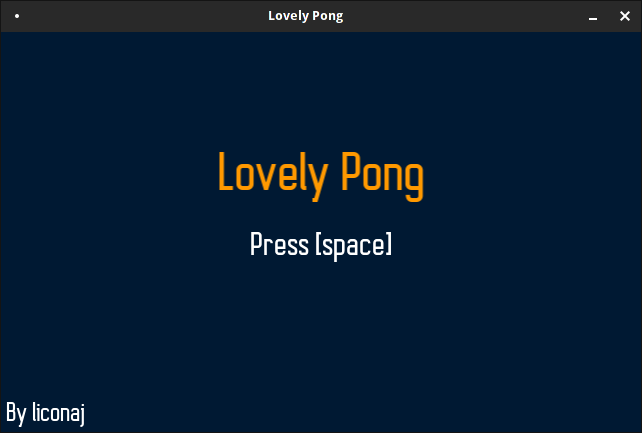
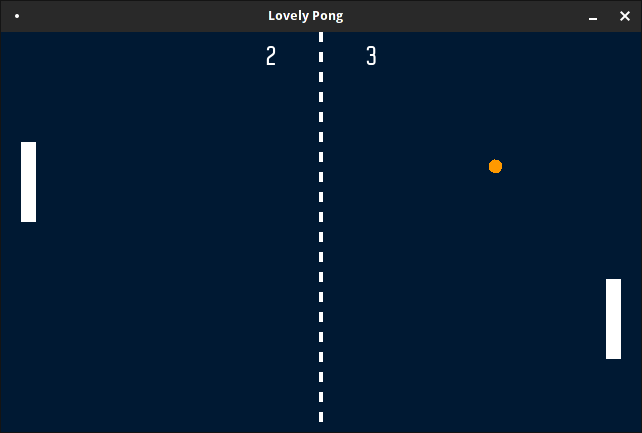
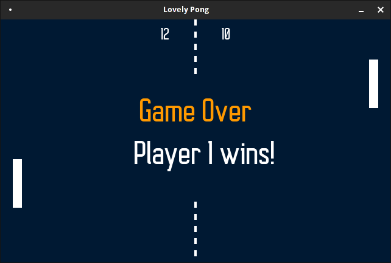

# Lovely Pong

This is simple Ping Pong Game made in the Lua framework LÖVE.

Most part of the code, and where I took the audio files from, was inspired both [minimnal love2d pong](https://gist.github.com/2bt/3869745) and [Pingpong](https://github.com/2bt/Pingpong) thanks to @2bt.

Here are some nice screenshots!

